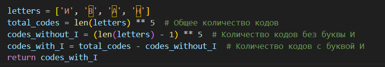
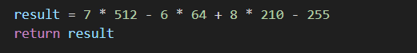
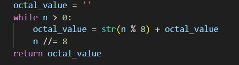
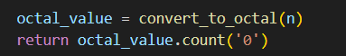
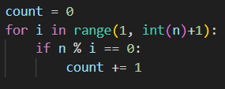
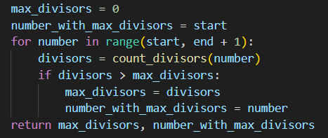

# Лабараторная работа №2

## Задание

## описание 
#### Задача 1: Сколько различных кодов может составить Иван?

#### Задача 2: Значение арифметического выражения

перевод в восьмиричную систему счисления

подсчет нулей 

#### Задача 3: Найти число с максимальным количеством делителей в заданном диапазоне
подсчет делителей

поиск макс. числа 

## Результаты вычислений

## Результаты доктеста

## Список использованных источников:

1. [Itertools в Python - Хабр](https://habr.com/ru/companies/otus/articles/529356/)
2. [itertools — Functions creating iterators for efficient looping](https://docs.python.org/3/library/itertools.html)
3. [Итерируем правильно: 20 приемов использования в Python модуля itertools](https://proglib.io/p/iteriruemsya-pravilno-20-priemov-ispolzovaniya-v-python-modulya-itertools-2020-01-03)
