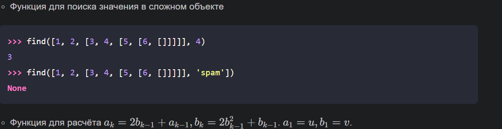
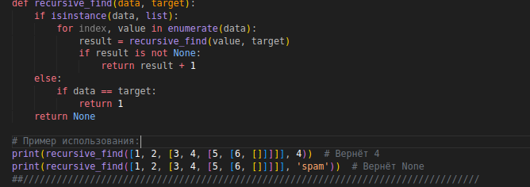
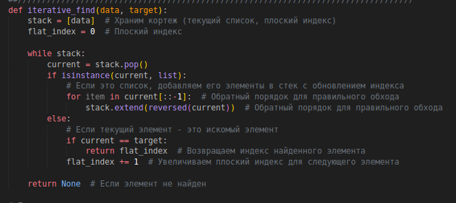
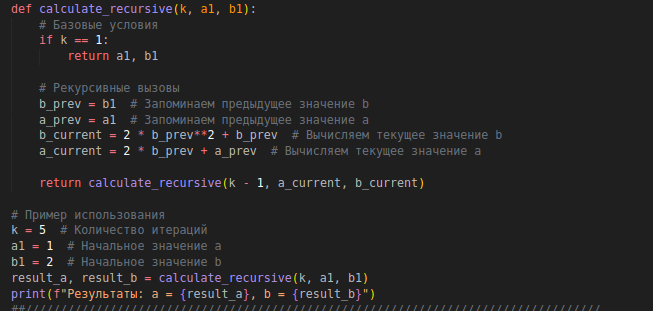
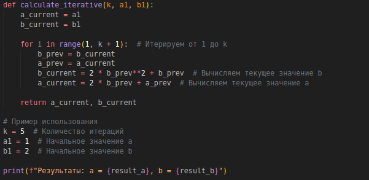
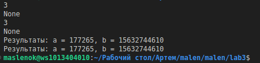

# Лабараторная работа №3

## Задание
#### Напишите две функции для решения задач своего варианта - с использованием рекурсии и без.

## описание 
#### 1 часть 
первый код с рекурсией второй без

#### 2 часть
первый код с рекурсией второй без

## Результаты вычислений

## Список использованных источников:

1. [Recursion in Programming - Full Course - freeCodeCamp.org](https://youtu.be/IJDJ0kBx2LM)
2. [🐍 Самоучитель по Python для начинающих. Часть 13: Рекурсивные функции - proglib.io](https://proglib.io/p/samouchitel-po-python-dlya-nachinayushchih-chast-13-rekursivnye-funkcii-2023-01-23)
3. [Как работает рекурсия – объяснение в блок-схемах и видео - Хабр](https://habr.com/ru/articles/337030/)
