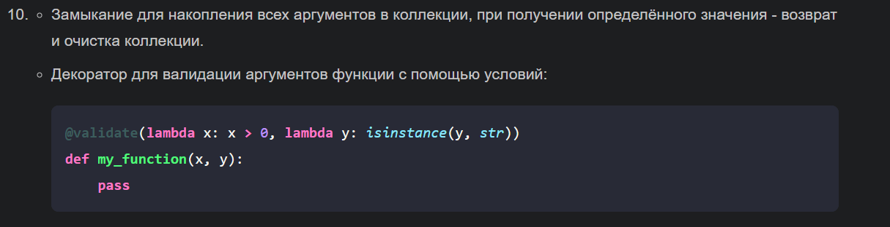
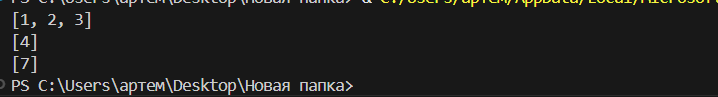
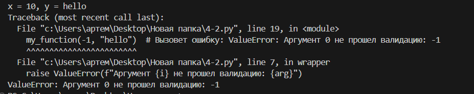

# Лабараторная работа №4

## Задание
#### Решите обе задачи своего варианта.
#### Примените декоратор к замыканию.

## Результат
#### 1 часть 
Функция make_accumulator создаёт и возвращает функцию-генератор (accumulator), которая накапливает переданные ей значения до тех пор, пока не будет передана специальная команда (в данном случае None). После получения этой команды функция возвращает накопленные значения и очищает внутреннюю коллекцию.
Как работает код:

    Создание функции-генератора: Функция make_accumulator() создаёт локальную переменную collection, представляющую собой список для хранения передаваемых значений.
    Определение внутренней функции accumulator: Внутренняя функция принимает один аргумент — value. Она проверяет, является ли этот аргумент специальным значением (None). Если да, она возвращает копию текущего содержимого списка collection и очищает сам список. Иначе добавляет переданное значение в список и возвращает None.
    Использование функции: Когда вызывается внешняя функция make_accumulator(), возвращается внутренняя функция accumulator. Эта функция используется для добавления новых элементов в список через последовательные вызовы. Когда передается специальное значение None, происходит сброс списка и возврат всех накопленных значений.

#### 2 часть
Декорированная функция validate предназначена для проверки входных аргументов функции на основе заданных валидаторов. Давайте разберемся, как она работает:

    Функция validate:
        Принимает произвольное количество валидаторов (функций), которые будут проверять соответствующие аргументы.
        Возвращает декоратор decorator, который применяется к декорируемой функции.
    Декоратор decorator:
        Получает декорируемую функцию func.
        Оборачивает её функцией wrapper, которая будет проверять аргументы перед вызовом оригинальной функции.
    Функция-обертка wrapper:
        Перебирает аргументы args и валидаторы validators одновременно.
        Для каждого аргумента вызывает соответствующий валидатор.
        Если какой-либо аргумент не проходит проверку, выводит сообщение об ошибке.
        Если все аргументы проходят проверку, вызывает оригинальную функцию func с теми же аргументами.

## Список использованных источников:
1. [Замыкания и декораторы в Python: часть 1 — замыкания](https://habr.com/ru/articles/781866/)
2. [Замыкания и декораторы в Python: часть 2 — декораторы](https://proglib.io/p/samouchitel-po-python-dlya-nachinayushchih-chast-13-rekursivnye-funkcii-2023-01-23)
