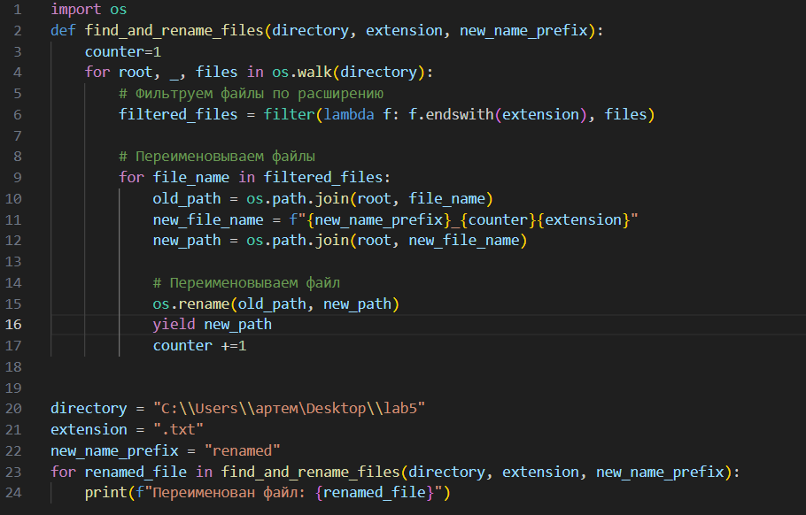
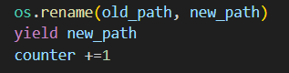
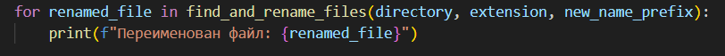
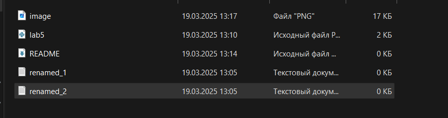

# Лабараторная работа №5

## Задание
#### Генератор, который обходит файловую систему в указанном каталоге и возвращает имена файлов с заданным расширением. Предусмотреть возможность обхода подкаталогов. Переименуйте найденные файлы.

## описание 
Генератор — это функция, которая возвращает последовательность значений с помощью ключевого слова yield. В отличие от обычных функций, которые возвращают результат сразу (с помощью return), генераторы возвращают значения по одному, "на лету", что позволяет экономить память и обрабатывать данные по мере их поступления.

#### import os 
 Модуль os предоставляет функции для работы с операционной системой, такие как обход файловой системы, переименование файлов, проверка существования файлов и т.д.

 
 ##### directory:
 Путь к каталогу, в котором нужно искать файлы.

##### extension:
 Расширение файлов, которые нужно переименовать (например, .txt).

##### new_name: 
Новое имя файла (без расширения).

 ##### os.walk(directory):
  Рекурсивно обходит каталог directory и возвращает три значения:

##### root: Текущий каталог.

##### _ :
 Список подкаталогов (мы его не используем, поэтому заменяем на _).
##### files:
 Список файлов в текущем каталоге.

##### lambda f: f.endswith(extension):
Лямбда-функция, которая проверяет, заканчивается ли имя файла на заданное расширение (например, .txt).
##### filter: 
Возвращает только те файлы, которые удовлетворяют условию (имеют нужное расширение).

##### file_name: 
Имя файла, которое прошло фильтрацию.
##### os.path.join(root, file_name):
Создает полный путь к файлу, объединяя текущий каталог (root) и имя файла (file_name).

##### os.rename(old_path, new_path):
 Переименовывает файл из old_path в new_path.

##### yield new_path:
 Возвращает новый путь к файлу как результат работы генератора.

 
 ##### for renamed_file in find_and_rename_files(...): 
 Используем генератор для переименования файлов и вывода их новых путей.

## Результат

## Список использованных источников:

1. [Recursion in Programming - Full Course - freeCodeCamp.org](https://youtu.be/IJDJ0kBx2LM)
2. [🐍 Самоучитель по Python для начинающих. Часть 13: Рекурсивные функции - proglib.io](https://proglib.io/p/samouchitel-po-python-dlya-nachinayushchih-chast-13-rekursivnye-funkcii-2023-01-23)
3. [Как работает рекурсия – объяснение в блок-схемах и видео - Хабр](https://habr.com/ru/articles/337030/)
