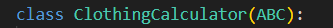

# Лабараторная работа №4

## Задание

## Описание
### Base_calculation

Импортирует из модуля abc (Abstract Base Classes) два элемента:
ABC - базовый класс для создания абстрактных классов.
abstractmethod - декоратор для обозначения абстрактных методов, которые должны быть переопределены в дочерних классах.

Определяет абстрактный базовый класс ClothingCalculator, который наследуется от ABC.
Этот класс будет использоваться как шаблон для других классов, связанных с расчетом одежды.

Конструктор класса, вызывается при создании экземпляра.
self - ссылка на экземпляр класса.
name - обязательный аргумент, имя объекта.

Приватный атрибут _name, хранящий переданное имя объекта.
(Подчеркивание _ означает, что атрибут защищенный, но не строго приватный.)

Инициализирует пустой список _history для хранения истории операций.

@property - Декоратор, превращающий метод в "геттер" для атрибута.
def name(self) - Возвращает значение _name. Позволяет обращаться к name как к атрибуту (например, obj.name).

Возвращает копию списка _history, чтобы избежать изменения оригинала извне.

Геттер для _fabric_price.

Декоратор для сеттера fabric_price.
def fabric_price(self, value) - Устанавливает значение _fabric_price, проверяя, что оно не отрицательное.

Декоратор, указывающий, что метод абстрактный и должен быть переопределен в дочерних классах.
def calculate_fabric(self, size) - Метод для расчета ткани (без реализации).

Возвращает строковое представление объекта (например, ClothingCalculator: Jacket).
Используется при вызове print(obj) или str(obj).

Возвращает формальное строковое представление объекта (например, ClothingCalculator name='Jacket').
Используется для отладки и вызова repr(obj).

### Clothing_items

Импортирует абстрактный базовый класс для всех калькуляторов одежды
Точка перед именем модуля указывает на относительный импорт из текущего пакета
Класс содержит общие методы и свойства для всех видов одежды

Наследует функциональность базового класса
Реализует специфичные для пиджаков расчеты

super()ъ__init__("Пиджак") вызывает конструктор родительского класса
Устанавливает имя изделия как "Пиджак"
self._base_fabric задает базовый расход ткани (1.5 метра)

Рассчитывает необходимое количество ткани для указанного размера

 if size < 42 or size > 62:
raise ValueError("Размер пиджака должен быть между 42 и 62")

Валидация входного параметра
Генерирует исключение при недопустимом размере

 fabric = self._base_fabric + max(0, (size - 46) * 0.1)

Базовый расход + 0.1 метра за каждый размер выше 46
max(0, ...) гарантирует неотрицательное значение

   self._history.append(f"Расчет ткани для размера {size}: {fabric:.2f}м")

   Сохраняет историю операций в списке _history
Форматирует строку с указанием размера и расхода ткани

Учитывает скидку 10% на комплект.

Позволяет комбинировать пиджак и брюки через оператор +
Возвращает объект костюма-тройки

Перегрузка оператора *
Возвращает размер скидки в зависимости от количества:
15% для 10+ штук
10% для 5+ штук

## Результат

## Список использованных источников:
1. [Разбираемся с g__init__ и self в Python](https://sky.pro/media/razbiraemsya-s-__init__-i-self-v-python/)
2. [Замыкания и декораторы в Python: часть 2 — декораторы](https://proglib.io/p/samouchitel-po-python-dlya-nachinayushchih-chast-13-rekursivnye-funkcii-2023-01-23)
3. [Использование @property вместо геттеров и сеттеров в Python](https://sky.pro/media/ispolzovanie-property-vmesto-getterov-i-setterov-v-python/)

## справочник 
#### @property
это декоратор в Python, который позволяет превратить метод класса в атрибут, доступный для чтения. Он используется для управления доступом к атрибутам объекта, добавляя логику при их получении, установке или удалении.
------Зачем нужен @property?
.Контроль доступа к атрибутам
.Можно добавить проверки перед установкой значения (например, запретить отрицательные числа).
.Можно вычислять значение "на лету" при обращении к атрибуту.
.Сокрытие внутренней реализации
.Позволяет изменить способ хранения данных, не ломая внешний код.
.Создание "вычисляемых" атрибутов
.Например, можно сделать атрибут full_name, который объединяет first_name и last_name.

-------.setter — это способ контролировать изменение атрибута в Python. Он работает вместе с @property, позволяя проверять или обрабатывать новое значение перед записью. Например, можно запретить отрицательные числа или автоматически пересчитывать связанные данные.

Короче:

Ставишь @property — чтобы атрибут можно было читать.

Добавляешь @x.setter — чтобы проверять или изменять значение перед сохранением.

Используешь как обычный атрибут — но с логикой внутри.

----@property делает методы похожими на атрибуты.
Позволяет добавлять логику при чтении/записи атрибутов.
Состоит из трёх частей: геттер, сеттер, делитер (но последние два не обязательны).
Используется для инкапсуляции и валидации данных.
-----пример в коде 
Геттер (fabric_price) — возвращает значение _fabric_price.
Сеттер — проверяет, что цена ткани не отрицательная, иначе вызывает ошибку.
#### h__init__ 
это специальная функция, которая вызывается при создании нового объекта класса. Она также известна как конструктор класса. Это место, где обычно устанавливаются начальные значения атрибутов класса.
self — это ссылка на текущий экземпляр класса. Это способ обращения к атрибутам и методам класса изнутри самого класса.

В примере выше, self.color = color устанавливает атрибут color текущего объекта класса Car в значение color, переданное в h__init__.

Следует отметить, что self не передается при создании нового объекта класса. Python автоматически передает ссылку на текущий объект в self.